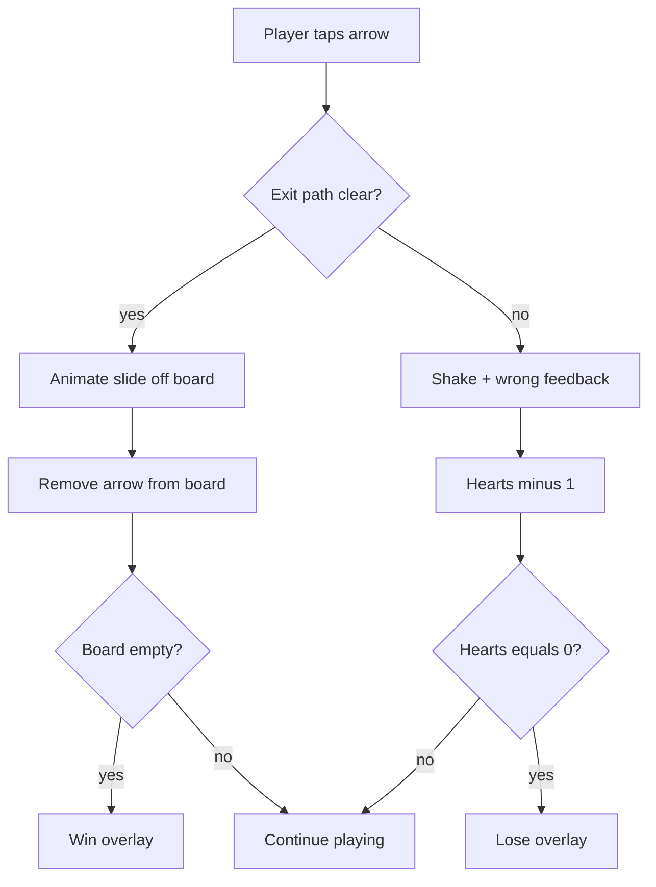
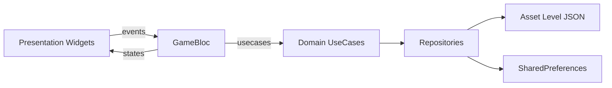

# Arrow Escape — Flutter MVP Plan

## Research summary (from live Play Store + downloaded screenshots)

Inspiration screenshots saved under [`docs/inspiration/`](docs/inspiration/).

| Reference | What we keep | What we restyle |
|-----------|--------------|-----------------|
| [Arrow Wave](https://play.google.com/store/apps/details?id=escape.arrow.dash) | Polyline arrows forming shapes; tap to exit; 3 hearts; undo/reset; no timer; hints | Black-on-white minimal look → bright colorful board + UI |
| [Arrow GO](https://play.google.com/store/apps/details?id=com.playcraft.finalarrow&hl=en) | Same exit-order puzzle; level badge; wrong-tap feedback; theme switcher affordance | Cluttered ad/IAP chrome → clean MVP without ads |

**Core rules (unchanged):**
1. Board is a grid occupied by **polyline arrows** (contiguous cells, arrowhead at the front).
2. Tap an arrow → it tries to slide **in the arrowhead direction**.
3. Move succeeds only if every cell from the head to the board edge (in that direction) is empty.
4. Success: arrow animates off-board and is removed. Fail: shake + lose 1 heart.
5. Clear all arrows = win. Hearts reach 0 = lose. Undo / restart supported. Hint highlights a currently escapeable arrow.



---

## Product screens (Full MVP)

| Screen | Purpose |
|--------|---------|
| Splash | Brand pulse + load progress |
| Home | Play / Levels / Settings / How to Play |
| Level Select | Grid of handcrafted levels with lock/star state |
| Gameplay | Main board + HUD (hearts, undo, reset, hint, theme chip) |
| Win | Stars + Next / Replay / Home |
| Lose | Out of hearts + Retry / Home |
| Settings | Sound, haptics, color scheme |
| How to Play | 3-step short tutorial |

---

## Wireframes

### Home
```
┌─────────────────────────────┐
│         ARROW ESCAPE        │  ← brand-first hero title
│     [animated arrow burst]  │
│                             │
│         [  PLAY  ]          │
│      [ Level Select ]       │
│   Settings    How to Play   │
└─────────────────────────────┘
```

### Gameplay (primary deliverable)
```
┌─────────────────────────────┐
│ [↶][↻]   LEVEL 12    [?][🎨]│
│          ♥ ♥ ♥              │
│                             │
│      ┌───────────────┐      │
│      │  colorful     │      │
│      │  polyline     │      │
│      │  arrows board │      │
│      └───────────────┘      │
│                             │
│      [💡 Hint]              │
└─────────────────────────────┘
```

### Level select
```
┌─────────────────────────────┐
│ ←  Levels                   │
│  [1★][2★][3 ][4🔒] ...      │
│  Easy · Medium · Hard tabs  │
└─────────────────────────────┘
```

---

## Visual direction (bright, not the stores’ mono look)

Centralized theming via `ThemeData` + custom `AppThemeExtension` (colors, radii, shadows, board strokes).

**Brand palette (fixed choice):**
- Background: soft sky wash (`#E8F7FF` → `#FFF8E7` vertical gradient)
- Primary CTA: `#FF5A5F` (coral)
- Secondary: `#00C2A8` (teal)
- Accent: `#FFC145` (sun)
- Board cells: white with subtle tint; arrows use a vivid per-arrow hue cycle (coral / teal / violet / amber / cyan)
- Hearts: `#FF4D6D`
- Typography: **Fredoka** (display) + **Nunito** (UI) via `google_fonts`

No purple-indigo “AI default”, no cream/terracotta broadsheet look.

**Assets (generate at implement time):**
- App icon (multi-color looping arrows)
- Heart / hint / undo / reset / lock / star SVG or PNG
- Lottie: arrow-exit trail, heart-break, win confetti (`lottie` package)
- Soft board glow / particle sparkles via CustomPainter

Inspiration assets already downloaded for reference; game assets will be original (not copied 1:1 from Play screenshots).

---

## Architecture (Clean + BLoC, zero `setState`)

```
lib/
  main.dart
  app.dart                          # MaterialApp + BlocProviders
  core/
    theme/                          # AppTheme, AppColors, ThemeCubit
    di/injection.dart               # get_it
    responsive/breakpoints.dart
    widgets/                        # shared animated buttons, etc.
  features/
    home/
    levels/
    game/
      domain/
        entities/                   # Arrow, Cell, Level, Direction
        repositories/               # LevelRepository, ProgressRepository
        usecases/                   # CanEscape, ApplyMove, GetHint, Undo
      data/
        models/                     # JSON level DTOs
        datasources/                # asset JSON + shared_preferences
        repositories/
      presentation/
        bloc/                       # GameBloc (+ events/states)
        pages/game_page.dart
        widgets/                    # Board, ArrowPainter, Hud, overlays
    settings/
      presentation/bloc/           # SettingsCubit / ThemeCubit
```

**Hard rules:**
- Presentation talks only to BLoC/Cubit via events; rebuild with `BlocBuilder` / `BlocListener` / `BlocSelector`.
- Domain has no Flutter imports.
- No `setState` anywhere (lint custom or review gate).

### Key BLoCs

- **GameBloc** — load level, tap arrow, undo, reset, hint, win/lose
- **ProgressCubit** — unlocked levels, stars
- **ThemeCubit** — active color scheme (3 bright schemes)
- **SettingsCubit** — sound / haptics



---

## Domain model & move engine

```dart
enum Direction { up, down, left, right }

class Cell { final int row, col; }

class ArrowEntity {
  final String id;
  final List<Cell> path;   // tail → head
  final Direction direction;
  final int colorIndex;
}

class LevelEntity {
  final int id;
  final String name;
  final int rows, cols;
  final List<ArrowEntity> arrows;
  final int hearts; // default 3
}
```

**`CanEscapeUseCase`:** from head, step one cell at a time in `direction` until off-grid; fail if any stepped cell is occupied by another arrow’s path.

**`ApplyMoveUseCase`:** if escape → remove arrow + push undo snapshot; else → hearts-- .

Levels shipped as JSON under `assets/levels/` (handcrafted pictorial layouts inspired by Wave’s cup/paw/butterfly idea — e.g. simple shapes early, denser later). MVP target: **30 levels** (10 easy / 10 medium / 10 hard), expandable.

---

## Gameplay screen implementation details

- `AspectRatio` + `LayoutBuilder` board: scales to phone/tablet; max size with center padding.
- Board drawn with `CustomPainter` (polylines + rounded joints + arrowheads); tap hit-test via path bounding.
- Animations (`flutter_animate` + `lottie`):
  1. Successful exit: arrow slides off in heading direction with motion blur trail
  2. Blocked: horizontal shake + red flash pulse
  3. Heart loss: pop + Lottie crack
  4. Win: confetti burst + board fade
  5. Hint: pulsing glow on safe arrow
- Responsive: phone portrait primary; tablet uses larger board + wider HUD gutters; text via `MediaQuery` / clamp helpers — **no hardcoded full-bleed absolute positions**.

---

## Dependencies (`pubspec.yaml`)

- `flutter_bloc`, `equatable`
- `get_it`, `injectable` (optional; start with manual `get_it`)
- `shared_preferences`
- `google_fonts`, `flutter_svg`
- `lottie`, `flutter_animate`
- `audioplayers` (optional soft SFX)
- `go_router` for navigation

---

## Implementation phases

1. **Foundation** — folder structure, DI, theme system (3 schemes), responsive helpers, empty routes
2. **Domain + engine** — entities, `CanEscape` / `ApplyMove` / undo stack; unit tests for collision rules
3. **Level data** — JSON schema + first 30 handcrafted levels
4. **Gameplay UI** — board painter, HUD, GameBloc wiring, animations (main screen first)
5. **Shell screens** — Splash, Home, Level Select, Win/Lose, Settings, How to Play
6. **Progress persistence** — unlock + stars
7. **Polish** — assets, SFX/haptics, tablet QA, remove any residual setState

---

## Success criteria

- Tapping blocked vs free arrows matches reference collision rules exactly
- Full flow: Home → Level → Play → Win/Lose → Next works with BLoC only
- Theme switch updates entire app from one theme source
- Layout usable on small phones and tablets
- Bright colorful board distinct from store screenshots while gameplay feels identical
